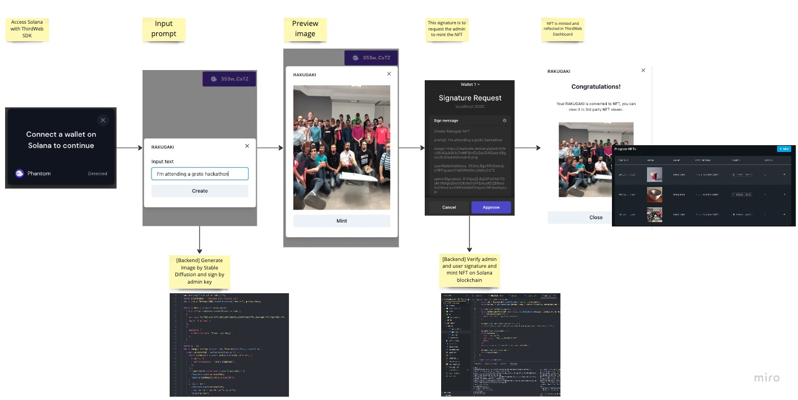

## RAKUGAKI

### Description

With Rakugaki, you can create stunning images and mint them as non-fungible tokens (NFTs) on the Solana blockchain. Powered by stable diffusion and the Thirdweb Solana SDK, Rakugaki is the perfect tool for anyone looking to create and certify AI-generated images. Simply input the text, and Rakugaki will generate an image from it. You can then mint your NFTs on the Solana blockchain without needing a third-party service. So what are you waiting for? Try Rakugaki today and see how easy and fun it is to create beautiful things with AI!

### Deployed Service

TBD

### Demo Video

TBD

### How it works

1. Access Solana with ThirdWeb SDK
2. Input prompt
3. [Backend] Generate Image by Stable Diffusion and sign by admin key
4. Preview image
5. This signature is to request the admin to mint the NFT
6. [Backend] Verify admin and user signature and mint NFT on Solana blockchain
7. NFT is minted and reflected in ThirdWeb Dashboard

### ThirdWeb Dashboard

https://thirdweb.com/sol-devnet/A4bDc7ZLrWUXHKjF2hVg2Zp9zmfeay3k2UF2u7Wdm6Ch/
